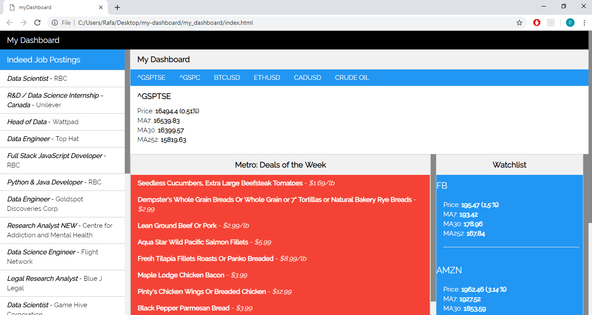

# My Dashboard

## Getting Started

In an attempt to try and save time, I built a simple dashboard application to run on my local machine. This dashboard consists of 4 components that helps me save some time in my day-to-day life. This app was built mainly using Python, JavaScript, HTML, and CSS. To start the dashboard and load the data into our HTML page, run the command `start run.bat` on the command line or double-click the [run.bat](./run.bat), making sure Python is installed on your machine.

## Functionality

As I do not require real-time data, the application will only retrieve new data when the [run.bat](./run.bat) file is run. The batch file consists of all the Python scripts needed to retrieve, extract, and load the data into our [data.js](./data/data.js) file, which is than loaded into our [index.html](./my_dashboard/index.html) file.

The 4 components of this dashboard is as follows:

  - Indeed Job Board - Using the Beautiful Soup library to web scrap job postings on Indeed that has certain keywords like 'data scien', 'data analy', 'python', or 'developer'. The listings are than queried into our dashboard.

  - Financial Indicators - Using a combination of the Yahoo Finance API and web scraping, the dashboard displays a few indicators such as the S&P/TSX Composite Index, S&P500 Index, BTC/USD prices, ETH/USD prices, CAD/USD prices, and the price of Crude Oil.

  - Metro Deals - Web scraping Metro flyers on redflagdeals.com to query the weekly sales at the local Metro and filtering it down based on certain keywords in my grocery list.

  - Stock Watchlist - By extracting data from the Yahoo Finance API and displaying certain stocks on the dashboard

## License

The MIT License (MIT)

Copyright 2018 Chris Kim

Permission is hereby granted, free of charge, to any person obtaining a copy of this software and associated documentation files (the "Software"), to deal in the Software without restriction, including without limitation the rights to use, copy, modify, merge, publish, distribute, sublicense, and/or sell copies of the Software, and to permit persons to whom the Software is furnished to do so, subject to the following conditions:

The above copyright notice and this permission notice shall be included in all copies or substantial portions of the Software.

THE SOFTWARE IS PROVIDED "AS IS", WITHOUT WARRANTY OF ANY KIND, EXPRESS OR IMPLIED, INCLUDING BUT NOT LIMITED TO THE WARRANTIES OF MERCHANTABILITY, ITNESS FOR A PARTICULAR PURPOSE AND NONINFRINGEMENT. IN NO EVENT SHALL THE AUTHORS OR COPYRIGHT HOLDERS BE LIABLE FOR ANY CLAIM, DAMAGES OR OTHER LIABILITY, WHETHER IN AN ACTION OF CONTRACT, TORT OR OTHERWISE, ARISING FROM, OUT OF OR IN CONNECTION WITH THE SOFTWARE OR THE USE OR OTHER DEALINGS IN THE SOFTWARE.
